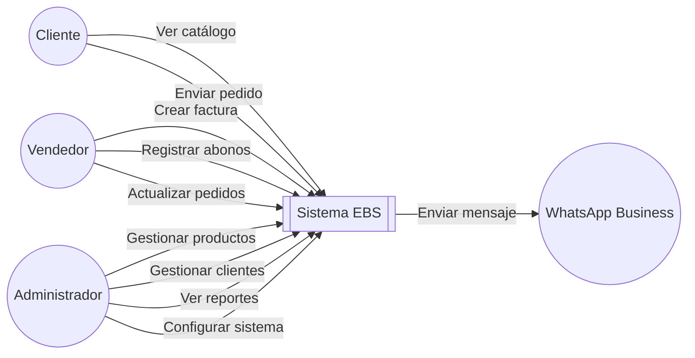
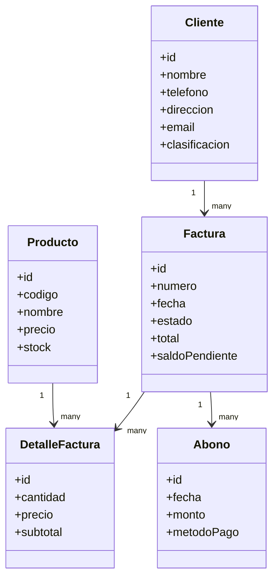
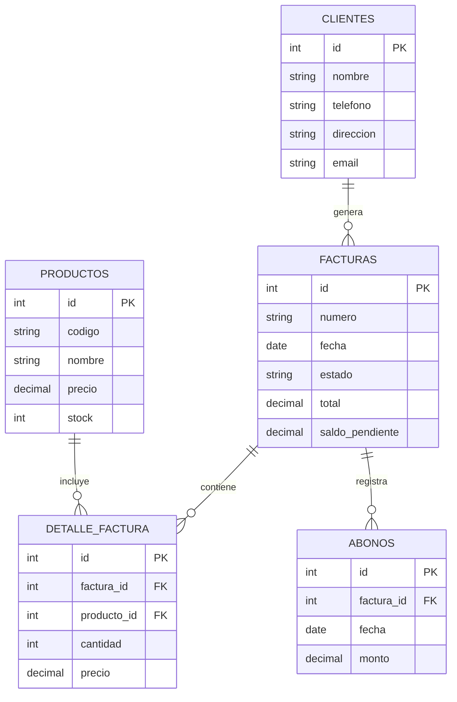
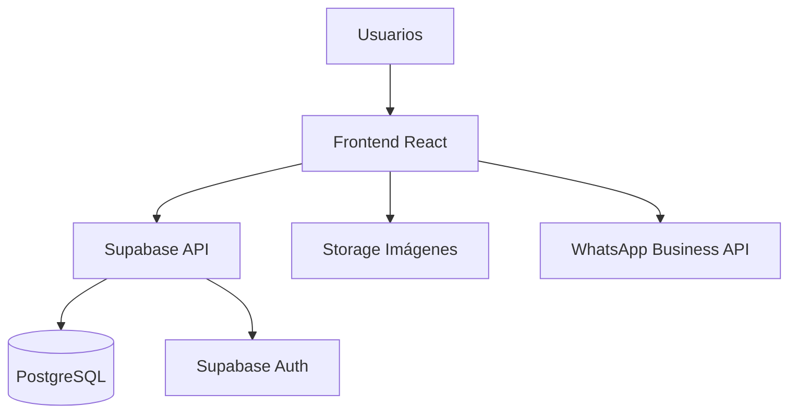

# DIAGRAMAS TÉCNICOS DEL SISTEMA

**Fecha:** 2 de febrero de 2026  
**Sistema:** Distribuciones EBS

---

## 1. DIAGRAMA DE CASOS DE USO (Mermaid)

---

## 2. DIAGRAMA DE CLASES (Mermaid)

---

## 3. MODELO ENTIDAD-RELACIÓN (ERD) - Mermaid

---

## 4. ARQUITECTURA GENERAL (Mermaid)

